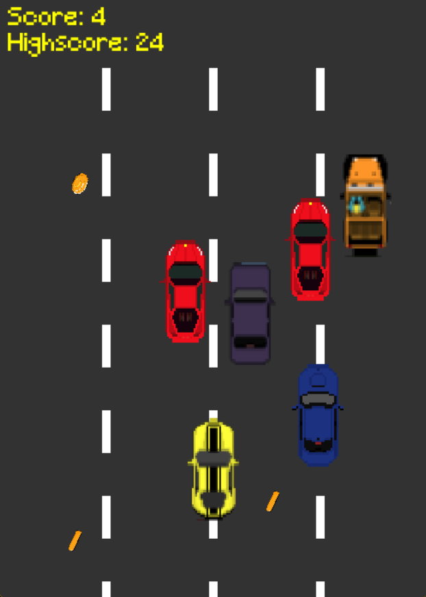

# Car Rush 🚗

**Car Rush** is a simple 2D car collecting and dodging game made with Python and Pygame.  
Control your car, collect coins, avoid other vehicles, and try to get the highest score!



---

## **Gameplay**

- Use **arrow keys** to move the main car:  
  - `←` Move Left  
  - `→` Move Right  
  - `↑` Move Up  
  - `↓` Move Down
- **Collect coins** to increase your score (+3 points per coin).  
- **Avoid other vehicles**: hitting them decreases your score by 1 point.  
- If your car is hit **3 times**, the game is over.  
- The game **automatically restarts** when it ends.  

---

## **Controls**

| Key | Action        |
|-----|---------------|
| ←   | Move Left     |
| →   | Move Right    |
| ↑   | Move Up       |
| ↓   | Move Down     |

---

## **Credits & License**

### Assets

- **Coin Graphics**  
  - Author: dinhaz  
  - License: Free to use in any project  

- **Car & Vehicle Graphics**  
  - Author: TMD_Studios  
  - License: Free to use in any project (with or without modifications) **with attribution**  
  - Website: [tmdstudios.wordpress.com](https://tmdstudios.wordpress.com)  

### Code
- All game code made by **codeWace (Wajiha Tasaduq)**.  
- You may use, share, and modify the code freely.  

---

## **Installation**

1. Install Python 3.x from [python.org](https://www.python.org/).  
2. Install Pygame:  
```bash
pip install pygame
